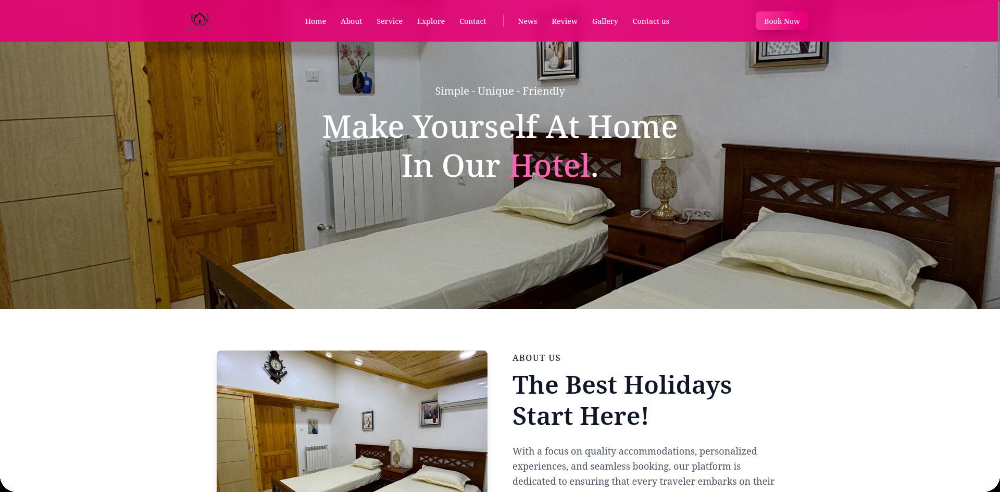

# 🏨 Happy Stay Residence

A modern and responsive web application built for showcasing and collecting reviews for **Happy Stay Residence**, a real hotel owned by my father. The site allows visitors to view information, share their experiences, and read reviews from other guests.



---

## ✨ Features

- ✅ Leave and submit detailed guest reviews
- ✅ Star-based rating system
- ✅ Clean, professional UI with responsive layout
- ✅ Review moderation and display
- ✅ Admin access (optional, depending on your implementation)

---

## 🛠️ Tech Stack

- **Frontend:** Next.js 14, Tailwind CSS, Lucide Icons
- **Backend:** Node.js, Express.js
- **Database:** MongoDB
- **API:** RESTful API for review handling
- **Auth:** JWT-based (optional)

---

## 🚀 Getting Started

Clone the project and install dependencies:

```bash
git clone https://github.com/fratsaislam/HSR-frontend
cd HSR-frontend
npm install
